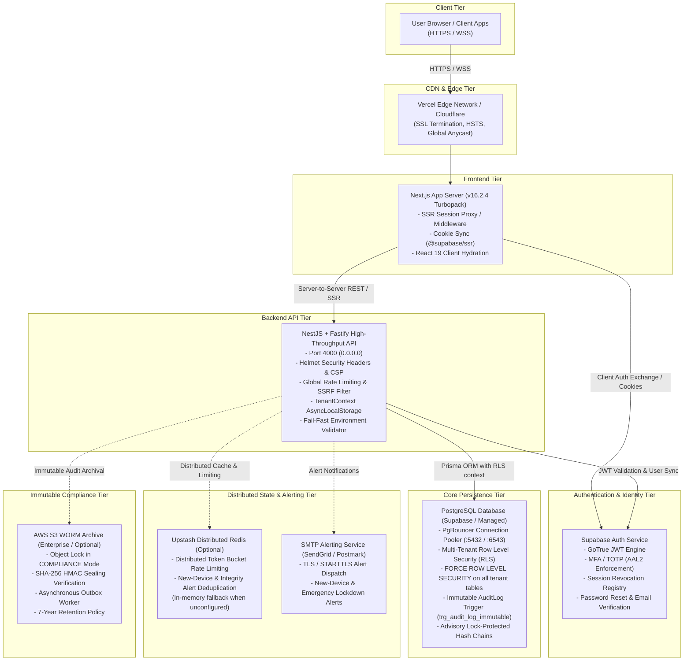

# ClixProCRM — Production Deployment Architecture

This document specifies the verified production deployment architecture for ClixProCRM, mapping physical network tiers, authentication flows, data persistence, and security controls.

---

## 1. Component Infrastructure Details

### 1.1 Frontend Hosting (`web`)
- **Technology**: Next.js 16.2.4 (Turbopack, React 19, Tailwind CSS).
- **Target Platform**: Vercel Edge / Node.js Runtime.
- **Security Middleware**: `web/proxy.ts` enforces `@supabase/ssr` session rotation, prevents access to protected routes without active tokens, and redirects unauthenticated users to `/login`.
- **Headers & CSP**: Strict CSP defined in `next.config.ts`, including HSTS (`max-age=63072000; includeSubDomains; preload`), `X-Frame-Options: SAMEORIGIN`, `X-Content-Type-Options: nosniff`, `Referrer-Policy: strict-origin-when-cross-origin`.

### 1.2 Backend API Hosting (`api`)
- **Technology**: NestJS 11 with `@nestjs/platform-fastify`.
- **Target Platform**: Dockerized container on AWS ECS Fargate, Render, or Railway.
- **Port**: Default `4000`, binding to `0.0.0.0` for container compatibility.
- **CORS Configuration**: Restricts origins dynamically to authorized domains (`ALLOWED_ORIGINS`, Vercel production preview domains, localhost during development).
- **Security Pipeline**:
  - `@fastify/helmet` with hardened CSP and HSTS.
  - Fail-fast startup validator (`SecurityConfigValidator`) checking encryption keys, database URLs, and cryptographic secrets.
  - Request-scoped tenant context isolation via Node.js `AsyncLocalStorage`.

### 1.3 Database & RLS Tier
- **Technology**: PostgreSQL 15+ hosted on Supabase.
- **Connection Architecture**: Transaction-level pooling via PgBouncer / Supabase Pooler (`DATABASE_URL`) with direct connection fallback (`DIRECT_URL`) for Prisma migrations.
- **Multi-Tenancy**: 
  - Strict Row Level Security enabled and **FORCED** on all CRM entities (`FORCE ROW LEVEL SECURITY`).
  - Session variable propagation via `set_config('app.current_tenant_id', ..., true)` in local database transactions.
  - `bypassrls` restricted strictly to Super Admin elevated operations.

### 1.4 Identity & Authentication
- **Technology**: Supabase Auth (GoTrue).
- **MFA Enforcement**: Authenticator App TOTP with `AalGuard` verifying `aal2` for administrative and sensitive mutation routes.
- **Separation of Keys**: Public `NEXT_PUBLIC_SUPABASE_ANON_KEY` used solely on client/SSR; `SUPABASE_SERVICE_ROLE_KEY` strictly isolated on backend.

### 1.5 Caching & Distributed Limiting (Upstash Redis)
- **Status**: Optional with safe single-instance in-memory fallback.
- **Role**: Cluster-wide rate limiting (`@upstash/ratelimit`), session activity deduplication, and alert throttling.

### 1.6 Immutable Audit Archiving (AWS S3 WORM)
- **Status**: Enterprise optional with transactional outbox queue in PostgreSQL.
- **Role**: AuditLog records sealed with HMAC-SHA256 and previous-record hash links. When enabled, records are copied to AWS S3 buckets locked in `COMPLIANCE` mode.

---

## 2. Environment Separation

| Environment | Frontend URL | Backend API URL | Database Target | Auth Isolation |
| :--- | :--- | :--- | :--- | :--- |
| **Local Development** | `http://localhost:3000` | `http://localhost:4000/api` | Supabase Dev / Local Postgres | Dev Supabase Project |
| **Staging / Preview** | `https://staging.clixprocrm.com` | `https://staging-api.clixprocrm.com/api` | Staging Branch Postgres | Staging Supabase Project |
| **Production** | `https://app.clixprocrm.com` | `https://api.clixprocrm.com/api` | Production Multi-Tenant DB | Production Supabase Project |
