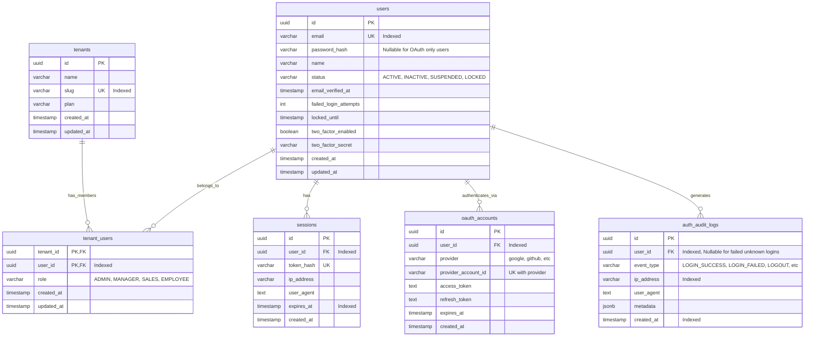

# Authentication Module Database Design (PostgreSQL)

This document provides a production-ready, normalized PostgreSQL schema design for the Authentication module, addressing the gaps identified in the current implementation.

## Schema Normalization & Additions
To make the schema production-ready, we introduce the following structures:
1.  **Security & Verification**: Added `email_verified_at`, `failed_login_attempts`, `locked_until`, and MFA fields to the `users` table.
2.  **Session Management**: Extracted session tracking into a dedicated `sessions` table to allow remote logout, device tracking, and strict invalidation.
3.  **Social Auth (OAuth)**: Added an `oauth_accounts` table to support federated logins (Google, GitHub, etc.) separately from local credentials.
4.  **Audit Trail**: Introduced `auth_audit_logs` for compliance, security monitoring, and detecting brute-force attacks.

---

## ER Diagram

---

## PostgreSQL Table Definitions & Relationships

### 1. `users` Table
Stores core identity and security state.
- **Primary Key**: `id`
- **Missing Indexes Added**: 
  - `UNIQUE INDEX idx_users_email ON users(email)`
- **Relationships**: Parent table for sessions, oauth_accounts, tenant_users, and audit logs.

### 2. `tenants` Table
Represents the workspace/organization.
- **Primary Key**: `id`
- **Missing Indexes Added**: 
  - `UNIQUE INDEX idx_tenants_slug ON tenants(slug)`
- **Relationships**: Parent table for tenant_users.

### 3. `tenant_users` Table (Join Table)
Maps users to tenants with specific roles (RBAC).
- **Primary Key**: Composite `(tenant_id, user_id)`
- **Foreign Keys**:
  - `tenant_id` references `tenants(id)` ON DELETE CASCADE
  - `user_id` references `users(id)` ON DELETE CASCADE
- **Missing Indexes Added**: 
  - `INDEX idx_tenant_users_user_id ON tenant_users(user_id)` (Crucial for querying "Which tenants does this user belong to?")

### 4. `sessions` Table
Manages active login sessions for strict invalidation and device management.
- **Primary Key**: `id`
- **Foreign Keys**:
  - `user_id` references `users(id)` ON DELETE CASCADE
- **Missing Indexes Added**: 
  - `INDEX idx_sessions_user_id ON sessions(user_id)`
  - `INDEX idx_sessions_expires_at ON sessions(expires_at)` (Critical for scheduled cleanup jobs of expired sessions)
  - `UNIQUE INDEX idx_sessions_token_hash ON sessions(token_hash)`

### 5. `oauth_accounts` Table
Normalizes federated login credentials (SSO/Social).
- **Primary Key**: `id`
- **Foreign Keys**:
  - `user_id` references `users(id)` ON DELETE CASCADE
- **Missing Indexes Added**: 
  - `UNIQUE INDEX idx_oauth_accounts_provider_account ON oauth_accounts(provider, provider_account_id)`
  - `INDEX idx_oauth_accounts_user_id ON oauth_accounts(user_id)`

### 6. `auth_audit_logs` Table
Immutable log of authentication events.
- **Primary Key**: `id`
- **Foreign Keys**:
  - `user_id` references `users(id)` ON DELETE SET NULL (Preserve logs even if user is deleted)
- **Missing Indexes Added**: 
  - `INDEX idx_audit_logs_user_id ON auth_audit_logs(user_id)`
  - `INDEX idx_audit_logs_created_at ON auth_audit_logs(created_at DESC)` (Optimizes time-series queries for recent events)
  - `INDEX idx_audit_logs_ip_address ON auth_audit_logs(ip_address)` (For identifying brute-force sources)

---

## Relationship Explanations

1. **Many-to-Many via `tenant_users`**: A `user` can belong to multiple `tenants` (Workspaces), and a `tenant` contains multiple `users`. This mapping table resolves the M:N relationship while attaching a contextual `role` (e.g., ADMIN in Tenant A, EMPLOYEE in Tenant B).
2. **One-to-Many (Users to Sessions)**: A `user` can be logged in on multiple devices concurrently. The `sessions` table tracks each instance separately.
3. **One-to-Many (Users to OAuth Accounts)**: A single `user` account can be linked to multiple third-party providers (e.g., logging in via Google OR GitHub mapping to the same email/user ID).
4. **One-to-Many (Users to Audit Logs)**: A `user` generates a stream of authentication events over time. The FK is `SET NULL` so if a user is deleted, the historical security logs remain intact.
