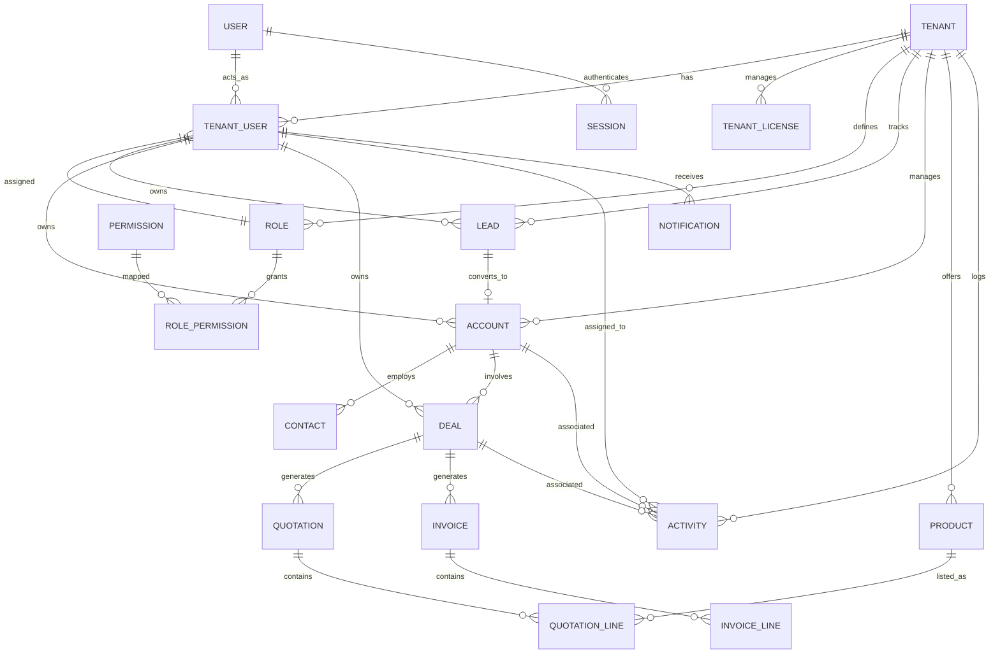

# CLIXPRO CRM v1.0: Final Database Architecture

This document serves as the definitive blueprint for the CLIXPRO CRM PostgreSQL database, designed specifically for the Prisma ORM. It synthesizes all module analyses to eliminate duplicates, enforce relational integrity, and establish an enterprise-grade multi-tenant architecture.

---

## 1. Core Architectural Strategies

### Multi-Tenant Architecture
- **Strategy**: Row-Level Isolation (Single Database). 
- **Implementation**: Every table (except system-wide dictionaries like `Permission`) MUST include a `tenantId` Foreign Key. Prisma middleware or strict service layer rules must automatically append `where: { tenantId }` to every query.

### Soft Delete Strategy
- **Strategy**: Non-destructive archiving for operational records.
- **Implementation**: A `deletedAt` (`DateTime?`) column is added to all core tables (`User`, `Lead`, `Account`, `Deal`, `Activity`). When a user "deletes" a record, `deletedAt` is set to `now()`. Prisma extensions will automatically exclude records where `deletedAt != null` from normal `findMany` queries.
- **Why?**: Hard deleting an employee or an account would corrupt historical revenue and quotation data. 

### Audit Logging
- **Strategy**: Universal mutation tracking.
- **Implementation**: An `AuditLog` table will track `CREATE`, `UPDATE`, and `DELETE` actions across critical entities, capturing the exact `changes` in a JSONB column.

---

## 2. Entity Relationship Diagram (ERD)

---

## 3. Schema Definitions & Normalization (3NF)

### 3.1 Identity, Access Management & RBAC
*Resolves duplicate Roles/Employees logic and removes plain-text passwords.*

- **Tenant**
  - `id` (UUID, PK), `name`, `slug` (Unique), `logoUrl`, `createdAt`
- **User**
  - `id` (UUID, PK), `email` (Unique), `passwordHash`, `name`, `emailVerifiedAt`, `twoFactorEnabled`, `twoFactorSecret`, `lockedUntil`, `failedAttempts`, `deletedAt`
- **TenantUser** (Pivot)
  - `id` (UUID, PK), `tenantId` (FK), `userId` (FK), `roleId` (FK), `status` (Enum: ACTIVE, INACTIVE), `joinedAt`
  - *Indexes*: `[tenantId, userId]` (Unique)
- **Session**
  - `id` (UUID, PK), `userId` (FK), `tokenHash`, `ipAddress`, `userAgent`, `expiresAt`
- **Role**
  - `id` (UUID, PK), `tenantId` (FK), `name`, `description`, `isSystem` (Boolean)
- **Permission** (System-wide dictionary)
  - `id` (UUID, PK), `resource` (String), `action` (String)
- **RolePermission** (Pivot)
  - `roleId` (FK), `permissionId` (FK)
  - *Indexes*: `[roleId, permissionId]` (Unique)

### 3.2 Configuration & Licensing
*Resolves the completely missing License and Settings persistence.*

- **TenantLicense**
  - `id` (UUID, PK), `tenantId` (FK, Unique), `planType` (Enum: FREE, PRO, ENTERPRISE), `status` (Enum: ACTIVE, EXPIRED), `maxSeats`, `usedSeats`, `validUntil`, `stripeSubscriptionId`
- **TenantSetting**
  - `id` (UUID, PK), `tenantId` (FK, Unique), `currency`, `timezone`, `dateFormat`
- **Integration**
  - `id` (UUID, PK), `tenantId` (FK), `provider` (Enum: GOOGLE, SLACK), `accessToken`, `refreshToken`

### 3.3 Core CRM (Sales Funnel)
*Resolves duplicate Lead/Customer models and missing assignment ownership.*

- **Lead** (Prospective)
  - `id` (UUID, PK), `tenantId` (FK), `firstName`, `lastName`, `email`, `company`, `status` (Enum: NEW, CONTACTED, QUALIFIED, LOST), `assignedToId` (FK to TenantUser), `convertedAccountId` (FK, Nullable), `deletedAt`
- **Account** (Customer/Company)
  - `id` (UUID, PK), `tenantId` (FK), `name`, `industry`, `website`, `status` (Enum: ACTIVE, CHURNED), `assignedToId` (FK to TenantUser), `deletedAt`
- **Contact** (Person at Account)
  - `id` (UUID, PK), `tenantId` (FK), `accountId` (FK), `firstName`, `lastName`, `email`, `phone`, `isPrimary`, `deletedAt`
- **Deal** (Pipeline Opportunity)
  - `id` (UUID, PK), `tenantId` (FK), `accountId` (FK), `name`, `amount` (Decimal), `currency`, `stage` (Enum: PROSPECTING, PROPOSAL, WON, LOST), `probability`, `expectedCloseDate`, `assignedToId` (FK to TenantUser), `deletedAt`

### 3.4 CPQ & Financials (Products, Quotes, Invoices)
*Resolves missing Products module and decoupled financial documents.*

- **Product**
  - `id` (UUID, PK), `tenantId` (FK), `name`, `sku`, `price` (Decimal), `isActive`, `deletedAt`
- **Quotation**
  - `id` (UUID, PK), `tenantId` (FK), `dealId` (FK), `accountId` (FK), `quoteNumber` (Unique), `status` (Enum: DRAFT, SENT, ACCEPTED, REJECTED), `totalAmount` (Decimal), `validUntil`, `createdById` (FK), `deletedAt`
- **QuotationLineItem**
  - `id` (UUID, PK), `quotationId` (FK), `productId` (FK), `quantity` (Int), `unitPrice` (Decimal), `total` (Decimal)
- **Invoice** & **InvoiceLineItem** (Mirrors Quotation structure, `status` Enum: DRAFT, UNPAID, PAID, VOID).

### 3.5 Activities, Logs & AI
*Resolves Task repurposing and missing AI tracking.*

- **Activity** (Unified Tasks & Meetings)
  - `id` (UUID, PK), `tenantId` (FK), `type` (Enum: TASK, MEETING, CALL, EMAIL), `title`, `description`, `status` (Enum: PENDING, COMPLETED), `dueDate`, `assignedToId` (FK), `dealId` (FK, Nullable), `accountId` (FK, Nullable), `deletedAt`
- **Notification**
  - `id` (UUID, PK), `tenantId` (FK), `userId` (FK), `type`, `title`, `message`, `isRead` (Boolean, default false), `entityId` (UUID, Nullable), `createdAt`
- **AuditLog**
  - `id` (UUID, PK), `tenantId` (FK), `userId` (FK), `entityType`, `entityId`, `action` (Enum: CREATE, UPDATE, DELETE), `changes` (JSONB), `createdAt`
- **AiChatSession** & **AiChatMessage**
  - Tracks conversational history for the AI Assistant, linked to `Tenant` and `User`.

---

## 4. Database Rules & Constraints

### 4.1 Indexing Strategy
To optimize performance and avoid O(N) memory crashes:
1. **Multi-Tenant Filter Indexes**: A composite index on `(tenantId, createdAt)` for all core tables (Leads, Deals, Activities) to speed up chronological dashboard queries.
2. **Lookup Indexes**:
   - `Account(name)`
   - `User(email)`
   - `Lead(email, company)`
3. **Foreign Key Indexes**: Prisma automatically creates indexes on foreign keys in PostgreSQL, ensuring `accountId` or `assignedToId` lookups are fast.

### 4.2 Cascading Deletions
Prisma `onDelete` rules:
- **Tenant**: `Cascade` (If a workspace is deleted, wipe everything to comply with GDPR).
- **Account**: `Cascade` on Contacts, Deals, and Activities (However, because we use Soft Deletes, this will actually be handled by application logic iterating and updating `deletedAt = now()` rather than DB-level cascading).
- **Products**: `Restrict` (A product cannot be hard-deleted if it is tied to an existing Quotation line item).

---

## 5. Implementation Order

To safely transition the codebase to this production architecture, the Prisma schema must be updated in the following sprint order to satisfy dependencies:

1. **Sprint 1 (Auth & Identity)**: `User`, `Tenant`, `TenantUser`, `Session`, `Role`, `Permission`.
2. **Sprint 2 (License & Config)**: `TenantLicense`, `TenantSetting`, `Integration`, `AuditLog`.
3. **Sprint 3 (CRM Core)**: `Account`, `Contact`, `Lead`, `Deal`, `Activity` (Replacing the old `Task` schema).
4. **Sprint 4 (CPQ & Financials)**: `Product`, `Quotation`, `Invoice`, Line Items.
5. **Sprint 5 (Auxiliary)**: `Notification`, `AiChat`.
